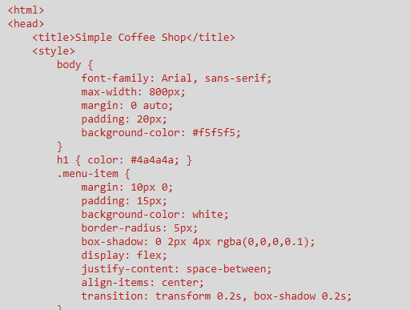
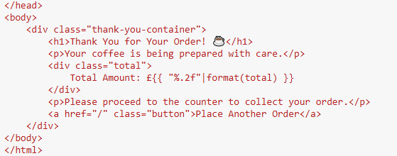
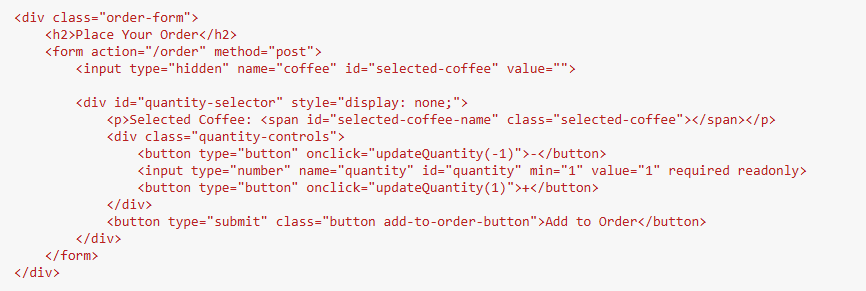
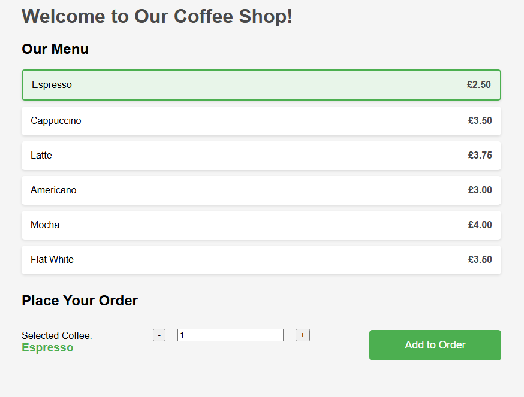
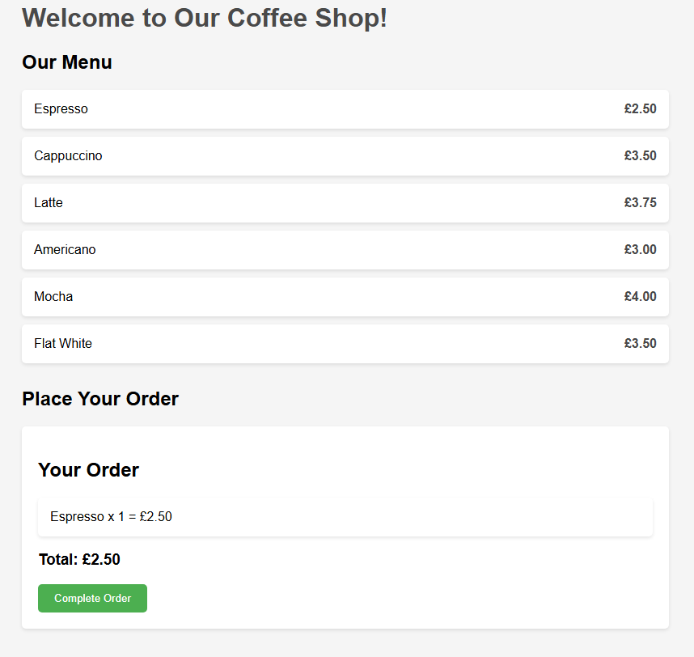
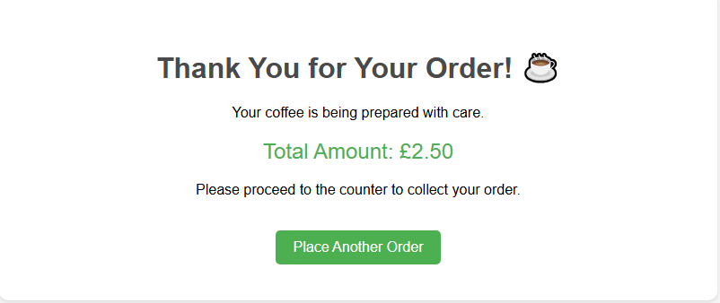

#Coffee Shop App

A web application for a coffee shop built with Flask allowing cusomters to view a menu, place orders, get a total, and finally have a thank you page.

The functions of this app is a home page, place order, complete order, thank you, and finally run coffee shop.

##This also includes HTML and this is the main functions:

This is used to structure and style my different elements in my app. So it has all the spacing, colour and size etc.
 

Dynamic Content, this is used to dynamically change elements such as total amount which would change according to the different orders.
 

Forms are used for users to order coffee so they can interact with the webpage.

##Screenshots

